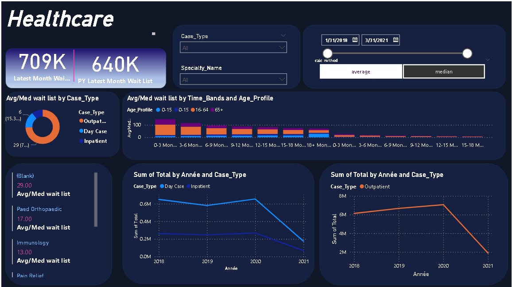

# Healthcare-Dashboard 

This project involves the creation of a dashboard for healthcare data, focusing on both inpatient and outpatient information. The dashboard aims to provide an intuitive interface for healthcare professionals to visualize and analyze patient data effectively.


## Table of Contents

- [Project Achievements](#project-achievements)
- [Technologies Used](#technologies-used)
- [Installation](#installation)
- [Dashboard Creation](#dashboard-creation)
- [Contact](#contact)

## Project Achievements

In this project, I have successfully completed the following tasks:

- [x] Requirement Gathering
- [x] Data Collection
- [x] Transformation and Modeling
- [x] Data Visualization Blueprint
- [x] Dashboard Layout and Design

## Technologies Used

- Power BI
- Data Sources (Open Source Datasets)


## Installation

Instructions on how to set up the environment to use the project:
1. Clone the repository:
   ```bash
    git clone git@github.com:Samiha128/Healthcare-Dashboard.git
2.Navigate to the project directory:
    
    cd Healthcare-Dashboard

After cd Healthcare-Dashboard, open the PBIX file located in the files folder of this project in Power BI
## Dashboard Creation



## contact

Feel free to contribute to this project by opening issues or submitting pull requests. Your input is welcome!

[](https://www.linkedin.com/in/samiha-el-mansouri-27505b250/)


   
